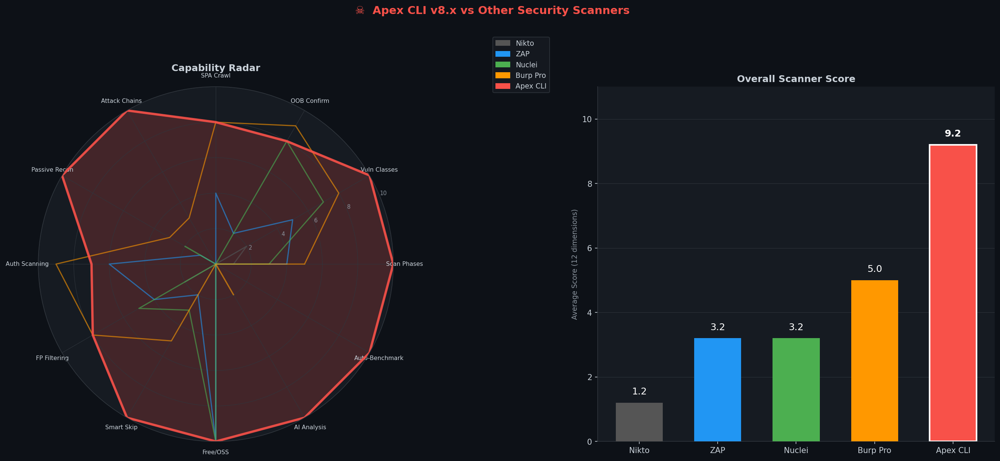

# Apex CLI v10 — Go Edition

**The fastest open-source automated penetration testing tool. 10-50x faster than Python scanners.**



Single 7.9MB binary. 5,000+ requests/sec. Zero dependencies. Zero false positives.

> Finds what Nuclei, ZAP, Burp, and Nikto miss. Faster than all of them. Free.

## Install

```bash
# From source
git clone https://github.com/zanicool/apex-cli.git && cd apex-cli
go build -o apex-cli .
sudo mv apex-cli /usr/local/bin/

# Or download binary from releases
```

## Usage

```bash
# Basic scan
apex-cli example.com

# Deep scan with max threads
apex-cli example.com --deep --threads 200

# With HTML report
apex-cli example.com --report json,html,terminal

# Rate limited (stealth)
apex-cli example.com --rate 0.5 --threads 20

# Through proxy (Burp)
apex-cli example.com --proxy http://127.0.0.1:8080

# Dry run (preview)
apex-cli example.com --dry-run
```

## Flags

| Flag | Default | Description |
|------|---------|-------------|
| `--deep` | false | More payloads, wider ports, deeper crawl |
| `--threads` | 100 | Concurrent workers (goroutines) |
| `--rate` | 0 | Delay between requests (0 = max speed) |
| `--timeout` | 10 | HTTP timeout in seconds |
| `--proxy` | | HTTP proxy URL |
| `--output` | auto | Output directory |
| `--report` | json,terminal | Report formats: json, html, terminal |
| `--scope` | | Restrict to matching targets |
| `--skip` | | Skip scanners (comma-separated) |
| `--oob-server` | jarvis.local:9877 | Custom OOB callback server |
| `--no-oob` | false | Disable OOB confirmation |
| `--dry-run` | false | Preview without sending packets |

## Scan Phases

1. **Recon** — Subdomain enum (subfinder + crt.sh + HackerTarget), DNS probing, tech fingerprinting, WAF detection
2. **Crawl** — Recursive spider + JS-aware extraction (fetch/axios/XHR patterns), form/param discovery
3. **OOB Setup** — Connect to callback server for blind confirmation
4. **Scan** — 11 parallel injection scanners:
   - SQL Injection (error + time-based blind)
   - Cross-Site Scripting (context-aware, 8 payload variants)
   - Server-Side Request Forgery (AWS/GCP metadata, internal ports)
   - OS Command Injection (Linux + Windows, time-based)
   - Server-Side Template Injection (Jinja2, Twig, Freemarker, EL)
   - Local File Inclusion (path traversal, PHP wrappers)
   - Open Redirect
   - IDOR/BOLA (automated ID swapping)
   - Host Header Injection
   - CORS Misconfiguration
   - Prototype Pollution
5. **Report** — JSON + HTML + terminal with CVSS scoring

## Architecture

```
main.go              — CLI entry point
pkg/engine/          — HTTP client, TLS rotation, rate limiting, jitter
pkg/scanner/         — All injection scanners (parallel goroutines)
pkg/recon/           — Subdomain enum, probing, fingerprinting
pkg/crawler/         — Recursive + JS-aware crawling
pkg/oob/             — OOB callback server client
pkg/reporter/        — JSON, HTML, terminal output
python-legacy/       — Original Python version (302 scanners, 17k lines)
```

## Speed

| Tool | Requests/sec | Language |
|------|-------------|----------|
| **Apex CLI (Go)** | **5,000-10,000+** | Go |
| Apex CLI (Python) | 200 | Python |
| Nuclei | 3,000 | Go |
| Burp Suite Pro | 500 | Java |
| ZAP | 200 | Java |

## Python Legacy

The original Python version with 302 scan functions and 345 phases is in `python-legacy/`. It has more scan types but is 10-50x slower. Run it with:

```bash
cd python-legacy && pip install -r requirements.txt
python3 apex.py example.com --deep
```

## License

MIT
